# `nextcov init` Decision Tree

This document explains the decision flow and options for the `nextcov init` command.

## Command Modes

```
npx nextcov init [options]
```

| Mode | Command | Description |
|------|---------|-------------|
| Interactive | `npx nextcov init` | Prompts for all options |
| Non-interactive | `npx nextcov init -y` | Uses defaults, no prompts |
| Client-only | `npx nextcov init --client-only` | Skips server coverage setup |

---

## Complete Flow Diagram


---

## Interactive Prompts Flow

```mermaid
flowchart LR
    subgraph Prompts
        direction TB
        A["1️⃣ E2E Directory<br/><i>default: e2e</i>"] --> B
        B{"2️⃣ Language<br/><i>auto-detect?</i>"} -->|Yes| C
        B -->|No| B2["Ask: TS or JS?"] --> C
        C["3️⃣ Coverage Mode<br/>○ Full<br/>○ Client-only"] --> D
        D["4️⃣ Merge Script?<br/><i>default: Yes</i>"] --> E
        E["5️⃣ Force Overwrite?<br/><i>default: No</i>"]
    end
```



---

## Mode Comparison

```mermaid
flowchart TB
    subgraph Full["Full Mode"]
        direction TB
        FA[/"global-setup.ts<br/>startServerCoverage()"/]
        FB[/"global-teardown.ts<br/>finalizeCoverage()"/]
        FC[/"test-fixtures.ts<br/>collectClientCoverage()"/]
        FD["dev:e2e script:<br/><code>NODE_OPTIONS=--inspect=9230</code>"]
        FE["Collects:<br/>✓ Server coverage<br/>✓ Client coverage"]
    end

    subgraph ClientOnly["Client-Only Mode"]
        direction TB
        CA[/"❌ No global-setup.ts"/]
        CB[/"global-teardown.ts<br/>finalizeCoverage()"/]
        CC[/"test-fixtures.ts<br/>collectClientCoverage()"/]
        CD["dev:e2e script:<br/><code>E2E_MODE=true</code>"]
        CE["Collects:<br/>✗ No server coverage<br/>✓ Client coverage"]
    end
```



---

## Which Mode to Choose?

```mermaid
flowchart TB
    Start{{"Need server-side<br/>code coverage?"}}

    Start -->|Yes| Full["Use Full Mode<br/><br/>Covers:<br/>• Server Components<br/>• API Routes<br/>• Middleware<br/>• Server Actions"]

    Start -->|No| Static{"Is your app..."}

    Static -->|"Static export<br/>(next export)"| ClientOnly
    Static -->|"SPA with<br/>external API"| ClientOnly
    Static -->|"Testing deployed<br/>environment"| ClientOnly
    Static -->|"Quick local<br/>testing"| ClientOnly
    Static -->|"None of these"| Consider["Consider Full Mode<br/>for complete coverage"]

    ClientOnly["Use Client-Only Mode<br/><br/>Simpler setup:<br/>• No --inspect flag<br/>• No global-setup.ts<br/>• Works with any URL"]

    style Full fill:#90EE90
    style ClientOnly fill:#87CEEB
```



---

## Coverage Mode Comparison

| Aspect | Full Mode | Client-only Mode |
|--------|-----------|------------------|
| **Files created** | global-setup.ts, global-teardown.ts, test-fixtures.ts | global-teardown.ts, test-fixtures.ts |
| **playwright.config** | `globalSetup` + `globalTeardown` | `globalTeardown` only |
| **nextcov config** | Default (collectServer: true) | `collectServer: false` |
| **dev:e2e script** | `NODE_OPTIONS=--inspect=9230` | `E2E_MODE=true` |
| **Server coverage** | ✓ Collected via CDP | ✗ Skipped |
| **Client coverage** | ✓ Collected via Playwright | ✓ Collected via Playwright |
| **Requirements** | Node.js inspector, CDP port | Just Next.js dev server |

---

## CLI Options Reference

| Option | Default | Description |
|--------|---------|-------------|
| `-y, --yes` | false | Skip prompts, use defaults |
| `--e2e-dir <dir>` | `e2e` | E2E test directory |
| `--js` | false | Use JavaScript (default: TypeScript) |
| `--client-only` | false | Client-only mode (no server coverage) |
| `--no-merge` | false | Skip coverage:merge script |
| `--force` | false | Overwrite existing files |

---

## Example Flows

### 1. Quick Start (defaults)

```bash
npx nextcov init -y
```

Creates Full mode setup with:
- `e2e/global-setup.ts`
- `e2e/global-teardown.ts`
- `e2e/fixtures/test-fixtures.ts`

### 2. Client-only for Static Site

```bash
npx nextcov init --client-only -y
```

Creates simplified setup with:
- `e2e/global-teardown.ts`
- `e2e/fixtures/test-fixtures.ts`
- No `--inspect` flag needed

### 3. Custom Directory

```bash
npx nextcov init --e2e-dir tests/e2e -y
```

Creates setup in `tests/e2e/` directory.

### 4. JavaScript Project

```bash
npx nextcov init --js -y
```

Creates `.js` files instead of `.ts`.

---

## Next Steps After Init

### Full Mode

```bash
# 1. Start Next.js with inspector
npm run dev:e2e

# 2. Run tests
npx playwright test

# 3. View report
open coverage/e2e/index.html
```

### Client-only Mode

```bash
# 1. Start Next.js (or use deployed URL)
npm run dev:e2e
# Or set baseURL in playwright.config for deployed environments

# 2. Run tests
npx playwright test

# 3. View report
open coverage/e2e/index.html
```
